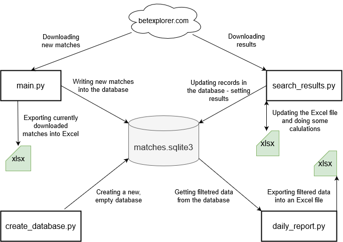

## About:
This program scrapes the betexplorer.com website and saves football matches into an sqlite database if these matches match certain criteria (the match should start int the next 3 hours, the odds are in a certain interval, etc.). The program also exports the currently found matches into an Excel file. The currently found matches can also be sent to a Telegram group via the Telegram API. (`main.py`)

Another script can export all the matches from a certain day into an Excel file. (`daily_report.py`). The script `download_results` downloads the results (number of goals) for the matches and updates them in the database.

## Setting up the program:
1. create `db` and `export` folders in the root of the project folders. The export is for the Excel files and the db for the database file.
2. Configure the `src/constants.py` file, set the User agent for the browser, export folder path and database path.
3. Install the following modules: `bs4, lxml, gooey, openpyxl, requests, argprase`

## These scripts were created only to learn about web scraping, not for regular for-profit use. !!!Use them at your own risk!!!

## Scripts:
+ `main.py` - downloads the matches from betexplorer.com website with some restrictions which are requested from my client
+ `create_database.py` - creates the database for the program. The database should be called `matches.sqlite3`
+ `search_results.py` - downloads match results for a selected file, does some business logic and updates results in the database
+ `daily_report.py` - dumps all the records from the database int an Excel file for a particular day chosen by the user

## Data flow:

